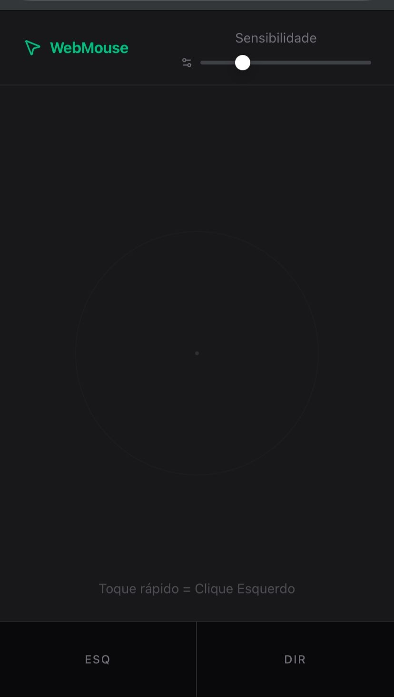

<div align="center">

  <h1>Web Mouse</h1>

  <p>
    <strong>Transforme seu smartphone em um Trackpad Wi-Fi de baixa latência para o seu PC.</strong>
  </p>

  
  
  
  
  

</div>

---

## 📖 Sobre

O **Web Mouse** é uma aplicação Full Stack que permite controlar o cursor do mouse do computador remotamente usando a tela sensível ao toque de um dispositivo móvel conectado à mesma rede Wi-Fi.

Diferente de soluções simples que mapeiam posições absolutas, este projeto implementa um algoritmo de **movimento relativo (deltas)** com **throttling adaptativo**, garantindo uma experiência fluida similar a um trackpad nativo de notebook.



## 💡 Motivação

A ideia nasceu de um problema de usabilidade no meu dia a dia.

Eu utilizo **fones de ouvido sem fio**, o que me dá liberdade para assistir a filmes ou vídeos deitado na cama ou afastado da mesa. No entanto, meu **mouse é com fio**.

Sempre que eu precisava pausar um vídeo, pular um anúncio ou ajustar o volume, eu era obrigado a levantar e ir até o computador. Para resolver essa lacuna na experiência, decidi criar uma solução usando a ferramenta que já estava na minha mão: meu celular.

## ✨ Funcionalidades

- **🖱️ Movimento Fluido:** Controle do cursor com suavização e sensibilidade ajustável.
- **👆 Gestos Inteligentes:**
  - *Tap to Click:* Toque rápido para clique esquerdo.
  - *Drag & Drop:* Suporte a arrastar itens.
- **🎛️ Controle de Sensibilidade:** Slider em tempo real para ajustar a velocidade do cursor (DPI).
- **📳 Feedback Hápitco:** Vibração no celular ao registrar cliques.
- **🚀 Performance:** Sistema de acumulação de deltas para reduzir overhead de rede (HTTP Requests).

## 🛠 Tecnologias

### Frontend (Mobile Client)
- **React + Vite:** Para uma interface rápida e reativa.
- **TypeScript:** Tipagem estática para robustez.
- **TanStack Query:** Gerenciamento de estado assíncrono e mutações.
- **TailwindCSS:** Estilização moderna e responsiva.
- **Lucide React:** Ícones leves.

### Backend (Server)
- **FastAPI (Python):** Servidor de alta performance e baixa latência.
- **PyAutoGUI:** Biblioteca de automação para controle de hardware (mouse/teclado).
- **Pydantic:** Validação de dados.

## 🚀 Como Rodar

### Pré-requisitos
- [Node.js](https://nodejs.org/) (v18+)
- [Python](https://python.org/) (v3.10+)
- Um celular e um PC na mesma rede Wi-Fi.

### 1. Backend (Python)

```bash
# Clone o repositório
git clone https://github.com/samuel-bernardes/web-mouse.git
cd web-mouse/backend

# Crie um ambiente virtual
python -m venv venv
source venv/bin/activate  # Windows: venv\Scripts\activate

# Instale as dependências
pip install -r requirements.txt

# Inicie o servidor (acessível na rede local)
uvicorn app.main:app --host 0.0.0.0 --port 8000 --reload

```

### 2. Frontend (React)

```bash
cd ../frontend

bun install

# Descubra o IP local do seu PC
# Windows: ipconfig
# Linux/Mac: ifconfig ou ip a
# Exemplo: 192.168.0.105

# Crie um arquivo .env na raiz do frontend
echo "VITE_API_URL=http://192.168.0.105:8000" > .env

# Rode o projeto
bun dev --host

Acesse o link exibido no terminal (ex: http://192.168.0.105:3000) pelo navegador do seu celular.
```

### 🧠 Como Funciona (Engenharia)
Para evitar latência e "travamentos" comuns em implementações via HTTP, o Web Mouse utiliza duas estratégias principais:

<b>Deltas vs. Absoluto</b>: Em vez de enviar a coordenada exata da tela do celular (x: 200, y: 300), enviamos o deslocamento desde o último pacote (dx: +10, dy: -5). Isso permite que o mouse funcione independente da resolução da tela do PC ou do celular.

<b>Request Throttling</b>: O evento touchmove dispara dezenas de vezes por segundo (60Hz+). Enviar um POST request para cada evento derrubaria a performance. O Frontend acumula esses movimentos em memória e despacha um único pacote a cada 15ms, somando todos os vetores de movimento nesse intervalo.

<div align="center"> Feito com 💜 por Samuel Bernardes </div>